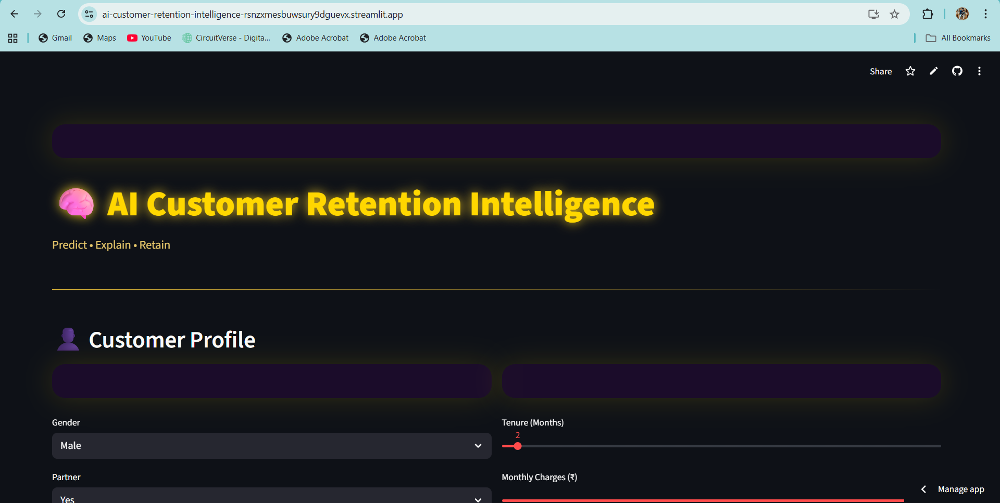
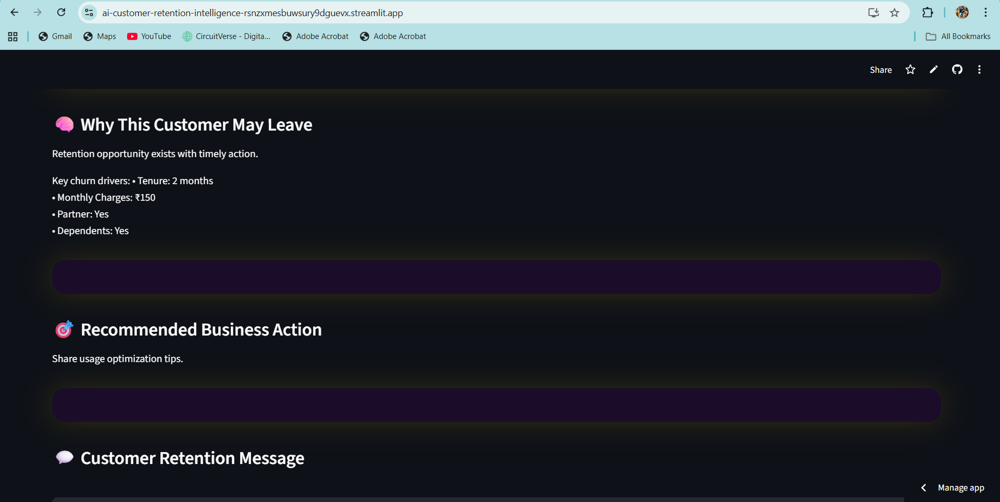

## 🧠 AI Customer Retention Intelligence — Explainable AI + GenAI System

A production-grade AI web application that identifies customer churn risk, explains why a customer may leave, and recommends personalized retention actions using Explainable AI logic and Generative AI.

This project demonstrates how real businesses use AI — not just predictions, but reasoning, decisions, and customer communication — all inside a premium, recruiter-friendly dashboard.

# 🚀 Live Application

👉 https://ai-customer-retention-intelligence-rsnzxmesbuwsury9dguevx.streamlit.app/

## 📸 Application Preview

  
  
  

# 🏗️ System Architecture

User enters customer details via a premium Streamlit UI

Rule-based Explainable AI engine computes churn risk score

Risk level is classified (Low / Medium / High)

GenAI (Groq LLM) generates:

Human-readable churn explanation

Strategic retention decision

Professional customer-facing message

Results are displayed in a clean, expandable dashboard

# ✨ Project Highlights

🔹 End-to-end AI decision intelligence (not just prediction)
🔹 Explainable churn logic (transparent & interview-ready)
🔹 Generative AI for real-world retention messaging
🔹 Premium dark UI (purple-black gradient, gold typography)
🔹 Clean architecture (logic, GenAI, UI separated)
🔹 Designed for FAANG-level interviews & portfolios
🔹 Cloud-deployable with free LLM tier (Groq)

# 🧠 Problem Statement

Customer churn is one of the largest revenue killers in subscription-based businesses.

Traditional ML models predict whether a customer will leave —
but business teams need more:

• Why is the customer at risk?
• What action should we take?
• What should we say to the customer?

This project solves all three — prediction + explanation + action — using modern AI.

# 📊 Customer Input Features

The system evaluates churn risk using:

• Customer tenure (months)
• Monthly charges
• Family association (partner / dependents)
• Engagement patterns (rule-based indicators)

These features are intentionally chosen to reflect real telecom & SaaS use cases.

# 🧠 AI & Decision Logic

🔹 Explainable AI (No Black Box)

A rule-based risk engine calculates:

• Churn risk score (0–1)
• Risk category (LOW / MEDIUM / HIGH)
• Clear reasons influencing the score

This ensures full transparency — critical for business trust.

🔹 Generative AI (Groq LLM)

A production-ready LLM generates:

• Human-friendly churn explanation
• Strategic retention recommendation
• Polished customer communication

All responses are dynamic, context-aware, and professional.

# 🖥️ Tech Stack
# 💻 Languages & Frameworks

🤖 AI & GenAI

# 🧠 Concepts

• Explainable AI (XAI)
• Decision Intelligence
• Customer Analytics
• AI-driven UX

# ▶️ Run Locally

To run the project on your system:

git clone https://github.com/kamrankausher/ai-customer-retention-intelligence.git
cd ai-customer-retention-intelligence

python -m venv venv
venv\Scripts\activate   

pip install -r requirements.txt

streamlit run app/ui/main_ui.py

# The app will be available at:

# ☁️ Deployment

# 🚀 Platform: Streamlit Cloud

Deployment steps:

Push project to GitHub

Connect repository on Streamlit Cloud

Set app/ui/main_ui.py as entry file

Add GROQ_API_KEY as a secret

Deploy — no paid services required

# 🎯 Use Cases

✔ Data Science & AI portfolios
✔ FAANG / Big-Tech interviews
✔ Product-oriented AI demonstrations
✔ Explainable AI case studies
✔ Resume & LinkedIn projects

# 🔮 Future Enhancements

• ML-based churn prediction model
• Multi-industry templates (SaaS, Banking, OTT)
• Customer segmentation
• Retention impact simulation
• Admin analytics dashboard

# 👤 Author

Kamran Kausher
🎓 Final-year B.Tech Computer Science student
💡 Data Science | Machine Learning | Generative AI

# 🌐 **Connect with me:**  
  
  

---

⭐ *This project focuses on practical ML engineering, clean deployment, and real-world usability rather than theoretical experimentation.*

