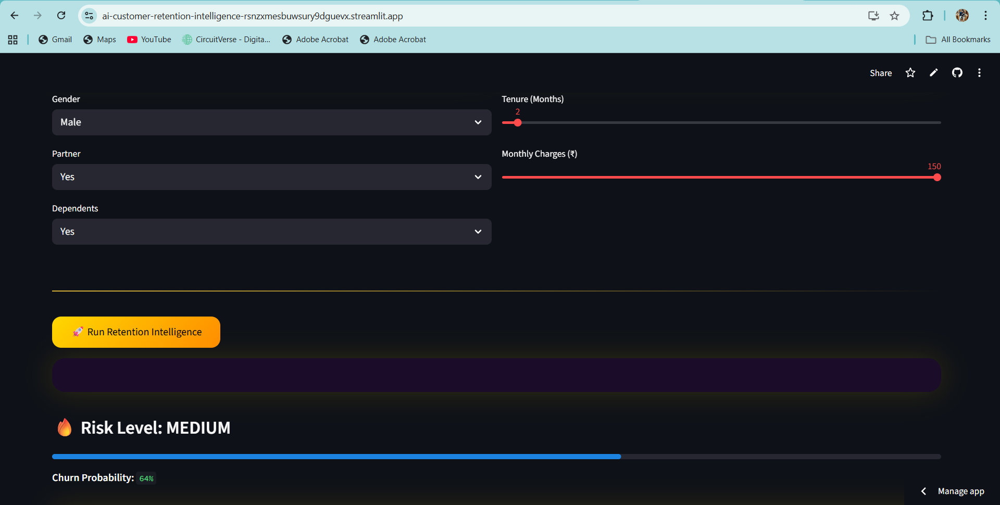

# 🧠 AI Customer Retention Intelligence  
### Explainable AI + Generative AI Decision System

A **production-grade AI web application** that identifies customer churn risk, explains *why* a customer may leave, and recommends **personalized retention actions** using **Explainable AI logic** and **Generative AI (Groq LLM)**.

This project demonstrates **real-world AI usage** — not just prediction, but **reasoning, decision-making, and customer communication** — all inside a **premium, recruiter-friendly dashboard**.

---

## 🚀 Live Application

👉 **https://ai-customer-retention-intelligence-rsnzxmesbuwsury9dguevx.streamlit.app/**

---

## 📸 Application Preview

<p align="center">
  
  <br/><br/>
  
  <br/><br/>
  
</p>

---

## 🏗️ System Architecture

1️⃣ User enters customer details via a **premium Streamlit UI**  
2️⃣ **Explainable AI engine** computes churn risk score  
3️⃣ Risk is classified as **Low / Medium / High**  
4️⃣ **Generative AI (Groq LLM)** produces:
   - Human-readable churn explanation  
   - Strategic retention recommendation  
   - Professional customer-facing message  
5️⃣ Results are displayed in a **clean, expandable dashboard**

---

## ✨ Project Highlights

🔹 End-to-end **AI decision intelligence** (not just prediction)  
🔹 **Explainable churn logic** (transparent & interview-ready)  
🔹 **Generative AI** for real-world retention messaging  
🔹 Premium dark UI (purple-black gradient, gold typography)  
🔹 Clean architecture (Logic • GenAI • UI separated)  
🔹 Designed for **FAANG-level interviews & portfolios**  
🔹 Cloud-deployable with **free LLM tier (Groq)**  

---

## 🧠 Problem Statement

Customer churn is one of the **largest revenue killers** in subscription-based businesses.

Traditional ML models answer:
> ❓ *Will the customer leave?*

But real businesses need:
- ❓ **Why** is the customer at risk?  
- ❓ **What** action should we take?  
- ❓ **What** should we communicate to the customer?

This project solves **all three** —  
**Prediction + Explanation + Action** — using modern AI.

---

## 📊 Customer Input Features

The churn analysis is based on:

• Customer tenure (months)  
• Monthly charges  
• Family association (partner / dependents)  
• Engagement patterns (rule-based indicators)  

These features mirror **real telecom & SaaS business logic**.

---

## 🧠 AI & Decision Logic

### 🔍 Explainable AI (No Black Box)

A transparent, rule-based engine calculates:

• Churn risk score *(0–1)*  
• Risk category *(LOW / MEDIUM / HIGH)*  
• Clear reasons influencing the risk  

This ensures **full explainability** — critical for business trust.

---

### 🤖 Generative AI (Groq LLM)

A production-ready LLM generates:

• Human-friendly churn explanation  
• Strategic retention decision  
• Polished customer communication  

All outputs are **dynamic, contextual, and professional**.

---

## 🖥️ Tech Stack

### 💻 Languages & Frameworks
- Python  
- Streamlit  

### 🤖 AI & GenAI
- Explainable AI (Rule-based logic)  
- Groq LLM (LLaMA-3)  

### 🧠 Concepts
- Explainable AI (XAI)  
- Decision Intelligence  
- Customer Analytics  
- AI-driven UX  

---

## ▶️ Run Locally

Clone and run the project locally:

```bash
git clone https://github.com/kamrankausher/ai-customer-retention-intelligence.git
cd ai-customer-retention-intelligence

python -m venv venv
venv\Scripts\activate

pip install -r requirements.txt
streamlit run app/ui/main_ui.py
```

---


### The application will be available at:

Local URL: http://localhost:8501

---

## ☁️ Deployment


#### 🚀 Platform: Streamlit Cloud

---


## 🚀 Deployment Steps

1️⃣ Push project to GitHub  
2️⃣ Connect repository on Streamlit Cloud  
3️⃣ Set app/ui/main_ui.py as entry file  
4️⃣ Add GROQ_API_KEY as a secret  
5️⃣ Deploy — no paid services required


## 🎯 Use Cases

✔ Data Science & AI portfolios  
✔ FAANG / Big-Tech interviews  
✔ Product-oriented AI demonstrations  
✔ Explainable AI case studies  
✔ Resume & LinkedIn projects


## 🔮 Future Enhancements

• ML-based churn prediction model  
• Multi-industry templates (SaaS, Banking, OTT)  
• Customer segmentation  
• Retention impact simulation  
• Admin analytics dashboard


## 👤 Author

Kamran Kausher  
🎓 Final-year B.Tech Computer Science student  
💡 Data Science | Machine Learning | Generative AI

---

## 🌐 **Connect with me:**  
[](https://www.linkedin.com/in/kamran-kausher-7585b0370)  
[](https://github.com/kamrankausher)  
[](mailto:kamrankausher@gmail.com)


---


⭐ This project focuses on practical AI engineering, explainability, clean architecture, and real-world business usability — not just model accuracy.


